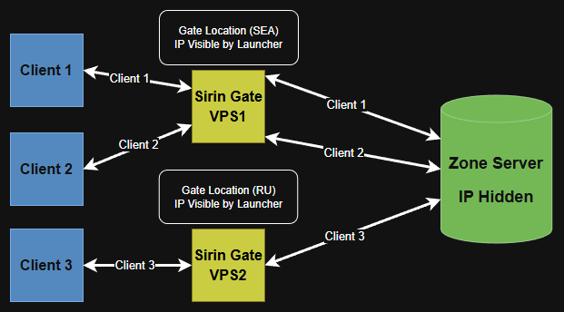

# Sirin Gate [0.48+]
 
> Introduced with update 0.48, Sirin gates provide a way to improve connection latency between clients and protect against targeted server attacks.



`Security:` Acts as a barrier, filtering incoming and outgoing traffic to protect the internal network from threats

`Hides server IP:` Only the gate servers connect directly to the zone - all client traffic is handled by the gate servers

`Improved performance:` Client data encryption is handled by the gate server offloading tasks from the zone server

`Faster routing:` Gate servers and Zone Server can make use of faster Data Center <--> Data Center  routes

### Download

> Requires C++ Redistributable x64 2022  [Download from Microsoft](https://aka.ms/vs/17/release/vc_redist.x64.exe)

Sirin gate is provided with the [Sirin files Download](../download.md) !Tools -> sirin-gate

### Configuration (Server)

`Zoneserver\WorldInfo\WorldInfo.ini`
```ini
[System]
...
GatePort = 27780
DirectPort = 27780
```

* `GatePort` is the port used by the Sirin Gate servers.
* `Direct-Port` is the direct port to connect to the server without the need for a gate

> If `DirectPort` is the same as `GatePort` then Gate server not used

---

`Zoneserver\RF_Bin\sirin-scripts\config-core\sirin-core-config.lua`

```
-- Configuration BEGIN
...
network.GatePassword = "12345678901"
```
* `GatePassword` 
Password for the gates to connect to the zone server (must match gate config. see below)

### Configuration (Gate)

The sirin-gate.exe is run on a seperate VPS/Dedicated server from your zone server. 

This can be in another country to make use of datacenter routing (to reduce ping from poor routing) or another server. 

> `sirin-gate/sirin-gate.ini`

```ini
[Settings]
MainThreadNum = 4
NetThreadNum = 4

FilterThreadNum = 4
DelayMin = 4000
DelayRand = 2000

LoginPort = 10001
ZonePort = 27780

RemoteIP = 127.0.0.1
RemoteLoginPort = 10002
RemoteZonePort = 27781
GatePassword = 12345678901
```

`LoginPort`
`ZonePort`
* Ports your game launcher will provide `Including the IP for your gate server` so the client can connect to the gate server.

> Ensure the game launcher you are using supports selecting from multiple IPs / Gates you can use the [Demo Launcher Source ](../demolauncher.md) as a starting point settings the gate IP manually via File -> Settings.

Better solutions feature the launcher showing a list of all open gates along with ping shown in ms and selecting from the list to connect

`RemoteIP`
`RemoteLoginPort`
`RemoteZonePort`
* Ports configured on the zone server for the gate server(s) to connect to

`GatePassword`
* Password for the gates to connect to the zone server (must match server config)

### Testing
> If configured correctly you now connect to the gate server IP/Ports via the launcher  
> The gate server will connect to the zone server and route your traffic through it.
