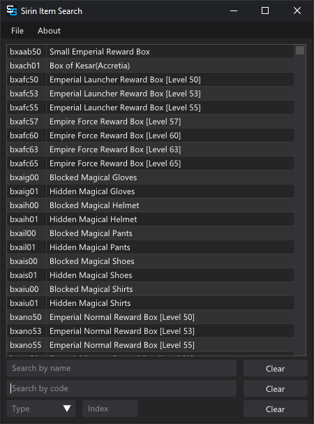
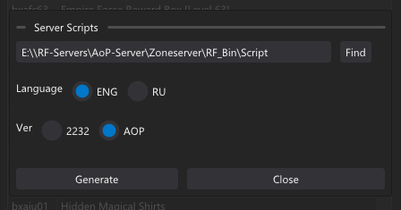

# Sirin Item Search [Sirin 0.52+]

> This tool is avaiable free of charge - If you have paid for this request a refund

Sirin Item Search simplifies the task of searching for items and codes required to spawn them

> Fully compatible with data generated by the `C++ Parser Tool`

### Download

> Requires C++ Redistributable x64 2022  [Download from Microsoft](https://aka.ms/vs/17/release/vc_redist.x64.exe)

Item Search tool is provided with the [Sirin files Download](../download.md) !Tools -> sirin-item-search.exe

MD5: 6826DDFE2158082FE0E2E2545C059A36

## Usage

### Creating Item Databases for searching   (.idat)

The tool will use the file `item.idat` found next to the `sirin-item-search.exe` 

> You can create your own item database for either  GU (2232) or AoP (4.15) 

`File` → `Create Item Database (.idat)` → `Find`

Navigate to your `AoP-Server\Zoneserver\RF_Bin\script` folder and click `Select Folder` → `Generate`

> Selecting RU when creating the database will switch the user interface to Russian

### Searching

`Search by Name` Begin typing a item name to filter results by name

`Search by Code` Begin typing a server item code to filter results by code

`Type` Enter numeric `server item type` or select from list

`Index` Enter numeric `item index` to filter results by index

#### Advanced Searching (Wild Cards)

> Code search supports searching using Wild Cards `*`

The * indicates this symbol can be anything within the item code

`iw**b05`  Find all weapon items that are Type B and level 5

`iub*b50`  Find all upper items for bellato level 50

> !Important - when adding new items follow the existing naming conventions for server codes to ensure easy searching with wild cards.