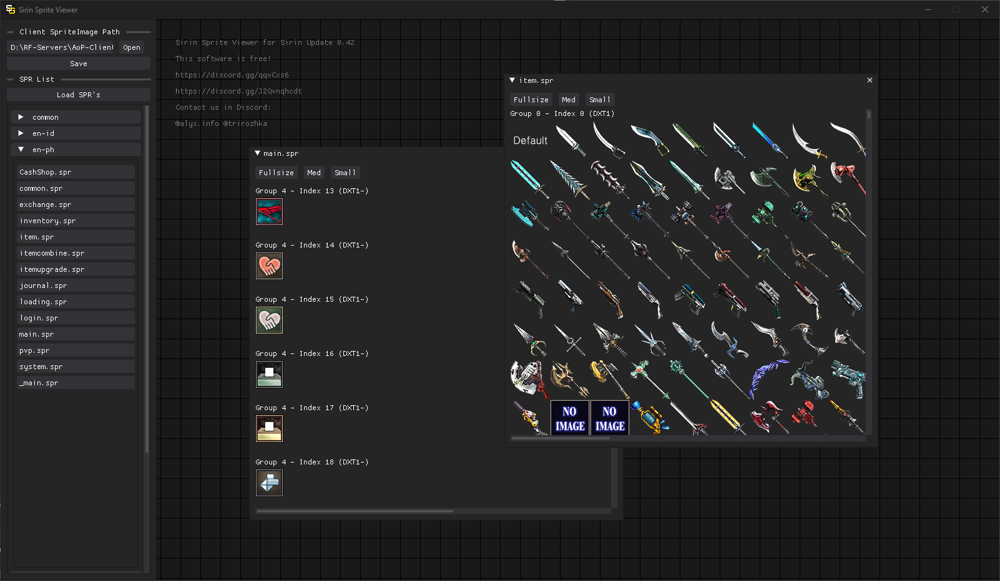
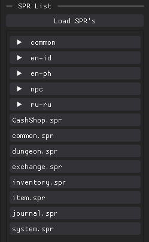

# Sprite Viewer [Sirin 0.42+]

> This tool is avaiable free of charge - If you have paid for this request a refund

Sprite Viewer simplifies searching for existing sprites to use in  [Function Menu](/lua/features/customwindow/functionMenu.md) and [Custom Windows](/lua/features/customwindow/window.md) requiring no file extraction

### Download

> Requires C++ Redistributable x64 2022  [Download from Microsoft](https://aka.ms/vs/17/release/vc_redist.x64.exe)

Sprite Viewer tool is provided with the [Sirin files Download](../download.md) !Tools -> sirin-sprite-viewer.exe

MD5: 8676A250A8ECD31C03E53FB8B145EB5C

### Client SPR Image Path (Viewing Sprites)
Client SpriteImage Path → `Open`

Locate the SpriteImage path in the client folder `AoP-Client\SpriteImage` → `Select Folder`

 A list of all found `.SPR` files will be shown - Click a `SPR` file to display it in the center of the viewer

> Next to each sprite will be the `Sprite Group` and `Sprite Index` use these when picking sprites for [Function Menu](/lua/features/customwindow/functionMenu.md) and [Custom Windows](/lua/features/customwindow/window.md)